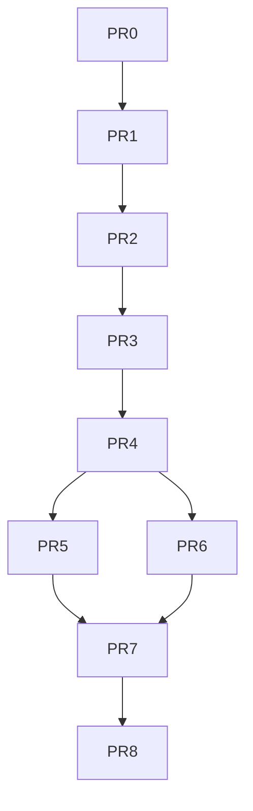

# Multi-Agent Runtime Expansion: Pi Support + Discord Transport

## Objective

Expand `agent-chat` from a Codex/Claude + iMessage/Telegram bridge into a runtime-agnostic control plane that supports:

1. agent runtimes: `codex`, `claude`, and `pi`
2. transports: `imessage`, `telegram`, and `discord`
3. mixed deployments where multiple runtimes and transports can coexist without transport- or agent-specific branching spread across the whole control plane

## Scope

- In:
  - runtime abstraction for Codex, Claude, and Pi
  - transport abstraction for iMessage, Telegram, and Discord
  - registry/schema generalization for multi-transport conversation bindings
  - CLI, setup, doctor, and routing updates required for Pi and Discord
  - tests and docs required to preserve current behavior while adding the new capabilities
- Out:
  - hosted orchestration / multi-user SaaS behavior
  - non-macOS iMessage support
  - rich Discord slash-command UX in the first implementation pass
  - Pi RPC-native control in the first implementation pass (track as follow-up after stable CLI/tmux integration)

## Acceptance Criteria

- Runtime support:
  - `--agent` accepts `codex`, `claude`, and `pi`
  - runtime-choice flow supports all three runtimes for missing-session creation
  - Pi sessions can be discovered, created, resumed, and routed through existing control-plane flows
- Transport support:
  - Discord inbound/outbound routing works for channel/thread interactions
  - transport bindings are generalized beyond Telegram-only thread keys
  - existing Telegram topic routing behavior remains intact
- Backward compatibility:
  - existing Codex/Claude + iMessage/Telegram setup flows remain valid without config changes
  - existing registry files load successfully without destructive migration
  - legacy env vars and registry keys continue to work for at least one migration cycle
- Code health:
  - `agent_chat_control_plane.py` becomes a thin orchestrator instead of the single home for all agent and transport logic
  - new tests cover adapter behavior, registry migration, and Discord/Pi regressions

## Current Status

- Planning only
- Repository review completed
- No behavior changes implemented yet

## Proposed Module Layout

The refactor should move the project toward a package layout while keeping the current top-level entrypoints as compatibility wrappers.

### Target layout

```text
agent_chat/
├── __init__.py
├── cli.py                         # argparse entrypoints; replaces giant main() body
├── control_plane.py               # run/once/notify orchestration
├── config.py                      # env parsing + compatibility normalization
├── registry.py                    # load/save/migrate registry state
├── routing.py                     # inbound command resolution + dispatch planning
├── types.py                       # shared TypedDict/dataclass-style runtime/transport types
├── tmux.py                        # tmux discovery, pane/window/session helpers
├── notify_hooks.py                # runtime-specific notify-hook install/update helpers
├── doctor.py                      # health checks and report assembly
├── adapters/
│   ├── __init__.py
│   ├── agent_base.py              # AgentAdapter protocol/base helpers
│   ├── codex.py                   # Codex adapter
│   ├── claude.py                  # Claude adapter
│   ├── pi.py                      # Pi adapter
│   ├── transport_base.py          # TransportAdapter protocol/base helpers
│   ├── imessage.py                # iMessage transport adapter
│   ├── telegram.py                # Telegram transport adapter
│   └── discord.py                 # Discord transport adapter
├── session_formats/
│   ├── __init__.py
│   ├── codex.py                   # session parsing helpers
│   ├── claude.py
│   └── pi.py
└── discord_runtime.py             # optional background Discord client/event queue manager

agent_chat_control_plane.py        # compatibility wrapper importing agent_chat.cli:main
agent_chat_notify.py               # compatibility wrapper or thin module using package helpers
agent_chat_outbound_lib.py         # compatibility wrapper or extracted library surface
agent_chat_reply_lib.py            # compatibility wrapper or extracted library surface
```

### Responsibilities

#### `agent_chat/cli.py`
- own argument parsing
- normalize legacy flags/env into the new config model
- delegate subcommands to orchestration functions

#### `agent_chat/control_plane.py`
- coordinate transports, routing, registry, queue drain, and notify ingestion
- contain high-level flow only; no runtime-specific filesystem assumptions

#### `agent_chat/registry.py`
- own schema versioning and migration
- canonicalize legacy Telegram-only binding structures into generic conversation bindings
- prune and validate registry records

#### `agent_chat/routing.py`
- parse inbound commands (`help`, `list`, `status`, `@ref`, `new`)
- resolve target session from explicit refs, reply context, or transport conversation bindings
- handle missing-session runtime choice

#### `agent_chat/adapters/agent_base.py`
Define a concrete adapter contract:

```text
id
label
home_path(config)
session_root(home)
session_env_keys()
resolve_bin(config)
find_session_files(home)
read_session_id(path)
read_session_cwd(path)
create_session(...)
resume_session(...)
install_notify_hook(...)
notify_status(...)
render_session_header(...)
```

#### `agent_chat/adapters/transport_base.py`
Define a concrete transport contract:

```text
id
label
enabled(config)
send_message(...)
poll_inbound(...) or start_listener(...)
normalize_conversation_key(...)
bootstrap(...)
doctor_checks(...)
```

## Runtime Adapter Plan

### Codex adapter
- preserve current behavior
- keep current config.toml notify-hook installation
- keep `~/.codex` defaults and `AGENT_CHAT_HOME`

### Claude adapter
- preserve current behavior
- keep current settings.json hook model
- keep `~/.claude` defaults and `CLAUDE_HOME`

### Pi adapter
Initial implementation should use the Pi CLI + session JSONL format, not RPC, to reduce first-pass integration risk and stay aligned with the repository's existing tmux-oriented control model.

#### Pi adapter assumptions for first pass
- binary: `pi` (override via `AGENT_CHAT_PI_BIN`)
- state dir: `~/.pi/agent` (override via `PI_CODING_AGENT_DIR` or adapter-specific env)
- session root: `~/.pi/agent/sessions`
- session detection: parse Pi session header JSONL (`type: session`, `id`, `cwd`)
- tmux launch command: start interactive `pi` in a pane, then send prompts through tmux
- non-tmux create/resume fallback:
  - create: `pi -p "<prompt>"`
  - resume via specific session path/id using `--session <path|id> -p "<prompt>"`

#### Deferred Pi follow-up
- optional upgrade to Pi RPC mode for richer state inspection / streaming control after first stable adapter release

## Transport Adapter Plan

### iMessage transport
- keep current AppleScript sender and `chat.db` polling model
- remain macOS-only
- continue to gate FDA setup on iMessage-enabled configurations only

### Telegram transport
- preserve existing chat/thread behavior
- move Telegram-specific binding logic behind the generic transport interface
- keep current stdlib HTTP integration

### Discord transport
Implement Discord as a separate adapter with a managed background client.

#### Discord first-pass design
- library: `discord.py` as an optional dependency group
- inbound: background Discord client receives messages and pushes normalized events into a thread-safe queue consumed by the synchronous control-plane loop
- outbound: adapter schedules `send()`/thread post operations onto the Discord client's event loop
- supported contexts:
  - channel messages
  - thread messages
  - optional direct-message support only if explicitly enabled later
- first-pass command grammar:
  - `help`
  - `list`
  - `status @<session_ref>`
  - `@<session_ref> <instruction>`
  - plain text in a bound thread/channel
- out of first pass:
  - slash commands
  - buttons / rich embeds / modal flows

## Exact Registry / Schema Changes

Current registry is transport- and Telegram-specific in critical areas. The new schema should add explicit versioning and generic conversation binding maps while preserving legacy fields.

### New top-level schema

```json
{
  "schema_version": 2,
  "sessions": {},
  "aliases": {},
  "last_dispatch_error": null,
  "pending_new_session_choice": null,
  "pending_new_session_choice_by_context": {},
  "conversation_bindings": {},
  "conversation_runtime_bindings": {},
  "ts": 0,

  "pending_new_session_choice_by_thread": {},
  "telegram_thread_bindings": {},
  "telegram_thread_tmux_bindings": {}
}
```

### Session record shape

```json
{
  "session_id": "<uuid-or-runtime-id>",
  "ref": "019cb278",
  "alias": "bugfix",
  "agent": "codex|claude|pi",
  "cwd": "/repo/path",
  "session_path": "/absolute/path/to/session.jsonl",
  "agent_home": "/absolute/path/to/runtime/home",
  "awaiting_input": false,
  "pending_completion": false,
  "pending_request_user_input": null,
  "last_attention_ts": 0,
  "last_response_ts": 0,
  "last_resume_ts": 0,
  "last_update_ts": 0,

  "tmux_pane": "%9",
  "tmux_socket": "/tmp/tmux-501/default",

  "telegram_chat_id": null,
  "telegram_message_thread_id": null,

  "bindings": {
    "telegram": {
      "chat_id": "-1001234567890",
      "thread_id": 222
    },
    "discord": {
      "guild_id": "123456789012345678",
      "channel_id": "223456789012345678",
      "thread_id": "323456789012345678"
    }
  }
}
```

Notes:
- `bindings` is authoritative for new code.
- legacy `telegram_chat_id` and `telegram_message_thread_id` are kept during the compatibility window for older code/doc assumptions.
- `agent_home` is added so the registry can resolve runtime-specific storage without re-deriving from process-global env every time.

### Generic conversation key format

Use a normalized string key everywhere transport-scoped routing is needed:

```text
telegram:<chat_id>:<thread_id-or-0>
discord:<channel_id>:<thread_id-or-0>
imessage:<handle-or-chat-guid>:0
```

Rules:
- threadless/channel-level contexts use `0`
- transport prefix is mandatory
- conversation keys are the source of truth for transport binding lookups

### `conversation_bindings`

Authoritative map from transport conversation context to session id:

```json
{
  "telegram:-1001234567890:222": "sid-telegram-bound",
  "discord:223456789012345678:323456789012345678": "sid-discord-bound"
}
```

### `conversation_runtime_bindings`

Transport-context map for best-effort tmux recovery and rebinding, generalized from `telegram_thread_tmux_bindings`:

```json
{
  "telegram:-1001234567890:222": {
    "tmux_pane": "%9",
    "tmux_socket": "/tmp/tmux-501/default",
    "agent": "codex"
  },
  "discord:223456789012345678:323456789012345678": {
    "tmux_pane": "%11",
    "tmux_socket": "/tmp/tmux-501/default",
    "agent": "pi"
  }
}
```

### `pending_new_session_choice_by_context`

Replaces thread-only pending creation state with a transport-generic map:

```json
{
  "discord:223456789012345678:323456789012345678": {
    "prompt": "continue",
    "action": "implicit",
    "source_text": "continue",
    "source_ref": null,
    "label": null,
    "cwd": "/repo/path",
    "created_ts": 1777777777,
    "transport": "discord"
  }
}
```

### Required registry migration behavior

On load:
1. if `schema_version` missing, assume legacy v1
2. materialize `conversation_bindings` from legacy `telegram_thread_bindings`
3. materialize `conversation_runtime_bindings` from legacy `telegram_thread_tmux_bindings`
4. materialize `pending_new_session_choice_by_context` from legacy `pending_new_session_choice_by_thread`
5. backfill per-session `bindings.telegram` from canonical conversation bindings
6. preserve legacy keys in-memory so unchanged code paths keep working during rollout

On save during compatibility window:
1. write new generic keys
2. dual-write legacy Telegram keys derived from the new generic keys
3. preserve `pending_new_session_choice` for non-threaded iMessage/global flows

## Environment / Config Changes

### New config model
Introduce a normalized config loader that supports both new and legacy env vars.

#### New env vars
- `AGENT_CHAT_TRANSPORTS=imessage,telegram,discord`
- `AGENT_CHAT_DEFAULT_AGENT=codex|claude|pi`
- `AGENT_CHAT_PI_HOME=/path/to/.pi/agent` (optional convenience alias)
- `AGENT_CHAT_PI_BIN=/path/to/pi`
- `AGENT_DISCORD_BOT_TOKEN=<token>`
- `AGENT_DISCORD_CHANNEL_ID=<default channel>`
- `AGENT_DISCORD_CHANNEL_IDS=<allowlist>`
- `AGENT_DISCORD_OWNER_USER_IDS=<allowlist>`
- `AGENT_DISCORD_ACCEPT_ALL_CHANNELS=1` (diagnostic only)

#### Legacy vars retained
- `AGENT_CHAT_TRANSPORT`
- `AGENT_CHAT_AGENT`
- existing Telegram vars
- existing Codex/Claude home vars

## Backward Compatibility Strategy

### CLI compatibility
- keep existing commands unchanged:
  - `run`
  - `once`
  - `notify`
  - `doctor`
  - `setup-notify-hook`
  - `setup-permissions`
  - `setup-launchd`
- extend `--agent` choices from `codex|claude` to `codex|claude|pi`
- keep current top-level script names and console scripts
- implement new package internals behind the existing command surface first

### Environment compatibility
- if `AGENT_CHAT_TRANSPORTS` is unset, derive it from legacy `AGENT_CHAT_TRANSPORT`
- if `AGENT_CHAT_DEFAULT_AGENT` is unset, derive it from `AGENT_CHAT_AGENT`
- keep `AGENT_IMESSAGE_TO`, Telegram env vars, `AGENT_CHAT_HOME`, and `CLAUDE_HOME` unchanged
- Pi-specific env vars are additive only

### Registry compatibility
- registry loading must accept both v1 (legacy/no-schema) and v2 (new generic) layouts
- registry saving should dual-write legacy Telegram keys for one release cycle
- older fields stay readable until Discord/Pi support is stable and docs are migrated

### Packaging compatibility
- keep `pyproject.toml` console entrypoints pointing at current module names initially
- top-level modules become wrappers around the new package code
- optional Discord dependency should not be required for non-Discord users

### Operational compatibility
- iMessage-only setups should behave exactly as today
- Telegram-only setups should not require Discord dependencies or startup threads
- launchd and doctor flows should skip Discord bootstrapping unless Discord transport is enabled

## Milestone-by-Milestone PR Plan

## PR0: Planning artifact
- Add this plan under `docs/exec-plans/active/`
- No code changes

## PR1: Package skeleton + compatibility wrappers

### Goal
Create the new package structure without changing behavior.

### Changes
- add `agent_chat/` package skeleton
- move pure helper logic first: config, registry shell, types, tmux helpers
- convert top-level scripts into thin wrappers where safe
- no adapter behavior changes yet

### Acceptance
- all existing tests pass unchanged
- command surface remains identical

## PR2: Agent adapter abstraction for existing runtimes

### Goal
Move Codex and Claude logic behind a runtime adapter interface.

### Changes
- add `AgentAdapter` contract
- implement `CodexAdapter` and `ClaudeAdapter`
- route existing helper calls through adapter lookup instead of scattered `if agent == ...`
- move notify-hook install/status logic into runtime adapters or `notify_hooks.py`

### Acceptance
- existing Codex/Claude flows are unchanged
- no Pi support yet
- tests updated to assert adapter-driven behavior

## PR3: Generic registry v2 + transport conversation keys

### Goal
Generalize transport binding state without changing active behavior.

### Changes
- add `schema_version`
- add `conversation_bindings`
- add `conversation_runtime_bindings`
- add `pending_new_session_choice_by_context`
- implement load/save migration + dual-write to legacy Telegram keys
- refactor Telegram thread helpers to operate via generic conversation-key utilities

### Acceptance
- existing registry files migrate on load without manual intervention
- Telegram tests remain green
- legacy and new registry representations round-trip safely

## PR4: Transport adapter abstraction for iMessage + Telegram

### Goal
Move transport-specific behavior behind transport adapters while keeping the current feature set.

### Changes
- add `TransportAdapter` contract
- implement `IMessageTransport` and `TelegramTransport`
- replace transport branching in send/poll/bootstrap/doctor paths with adapter dispatch
- add normalized `AGENT_CHAT_TRANSPORTS` config parsing

### Acceptance
- iMessage and Telegram behavior stays unchanged
- `AGENT_CHAT_TRANSPORT` still works
- control plane now supports multiple transports via normalized config list

## PR5: Pi runtime support (CLI/tmux first pass)

### Goal
Add Pi as a first-class runtime using CLI + tmux + session JSONL parsing.

### Changes
- implement `PiAdapter`
- add Pi binary/home discovery
- add Pi session discovery/parsing helpers
- add Pi create/resume command implementations
- extend runtime-choice flow to `codex|claude|pi`
- update `doctor` and `list/status` output to recognize Pi sessions

### Acceptance
- `--agent pi` works
- missing-session runtime choice offers Pi as an option
- Pi sessions can be created and resumed from inbound transport messages
- docs updated for Pi setup basics

## PR6: Discord transport support

### Goal
Add Discord as a third transport using the generic transport adapter layer.

### Changes
- add optional Discord dependency and adapter
- add background Discord client manager + event queue bridge
- support inbound channel/thread message normalization
- support outbound send to channel/thread
- add Discord allowlist/owner env vars
- bind Discord conversation keys to sessions using `conversation_bindings`

### Acceptance
- Discord channel/thread interactions route to sessions
- thread-bound plain text resolves to the bound session
- missing-session runtime choice works in Discord threads
- existing Telegram/iMessage behavior remains stable

## PR7: Setup, doctor, docs, and operator UX cleanup

### Goal
Make the new architecture operable and supportable.

### Changes
- extend doctor output with Pi + Discord health sections
- clarify setup docs for all supported runtime/transport combinations
- add troubleshooting entries for Discord auth/channel binding and Pi path/session discovery
- optionally add a `scripts/setup-discord-easy.sh` helper if warranted

### Acceptance
- README reflects supported runtimes/transports accurately
- docs explain compatibility behavior and migration clearly
- operators can diagnose runtime and transport health consistently

## PR8: Stabilization + optional follow-ups

### Goal
Finish cleanup after real-world testing.

### Candidate follow-ups
- Pi RPC-based adapter upgrade
- slash-command UX for Discord
- remove some legacy registry/env dual-write if safe after release cycle
- split oversized tests into transport/runtime suites

## Dependency Graph



## Testing / Validation Plan

### Per-PR expectations
- targeted unit tests for newly extracted modules
- full existing suite:
  - `python3 -m unittest discover -s tests -q`

### New test buckets to add
- `tests/test_registry_migration.py`
- `tests/test_agent_adapters.py`
- `tests/test_transport_adapters.py`
- `tests/test_pi_adapter.py`
- `tests/test_discord_transport.py`

### Key regression coverage
- legacy registry load/save compatibility
- runtime-choice flow for all three runtimes
- Telegram topic mapping migration still canonical
- Discord thread/channel binding behavior
- Pi session discovery + resume logic
- launchd/doctor behavior when Discord transport is disabled

## Decision Log

- 2026-03-29: use adapter extraction before adding Pi/Discord features so the control plane does not become more monolithic.
- 2026-03-29: introduce generic conversation bindings instead of adding more Telegram-specific registry keys.
- 2026-03-29: implement Pi first via CLI/tmux/session JSONL, not RPC, to minimize first-pass integration risk.
- 2026-03-29: implement Discord behind an optional dependency and background client so non-Discord users keep a lightweight install path.
- 2026-03-29: preserve current entrypoints, env vars, and registry fields during a compatibility window rather than forcing a destructive migration.

## Validation Notes

- Repository review completed against:
  - `README.md`
  - `docs/index.md`
  - `docs/architecture.md`
  - `docs/control-plane.md`
  - execution-plan examples under `docs/exec-plans/completed/`
- Baseline validation before planning:
  - `python3 -m unittest discover -s tests -q`
  - Result: `Ran 257 tests ... OK`
