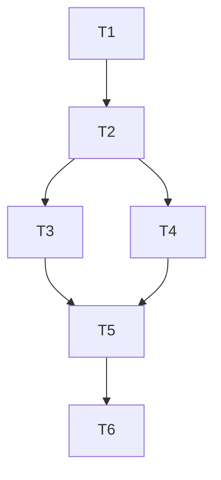

# Inbound Reply Routing: No-Tmux Resume + Missing-Session Agent Choice

## Objective

Implement inbound routing changes for iMessage/Telegram replies:

1. If a reply targets an existing session that has no usable tmux pane, append the reply via `resume` for that session's owning runtime (`codex` or `claude`).
2. If a reply targets a missing session, ask the user which runtime to use (`codex`/`claude`) before creating a background session.
3. If tmux launch fails after runtime choice, fallback to non-tmux session creation.

## Scope

- In:
  - `agent_chat_control_plane.py` routing behavior
  - session registry schema for pending runtime-choice state
  - tests in `tests/test_agent_chat_control_plane.py`
  - docs updates in `README.md`, `docs/control-plane.md`, `docs/troubleshooting.md`
- Out:
  - multi-pending correlation token system
  - additional transports
  - destructive state migrations

## Acceptance Criteria

- Existing-session/no-pane routing:
  - strict tmux mode no longer blocks `resume` fallback for no-pane `tmux_stale` class.
- Missing-session routing:
  - unresolved target generates runtime-choice prompt (`1/2`, `codex/claude`, `cancel`).
  - selection creates session with chosen runtime.
  - single pending runtime-choice request stored in registry (newest wins).
- Creation fallback:
  - tmux creation failure after runtime selection falls back to non-tmux creation.
- Regression tests:
  - new and existing control-plane tests pass.

## Dependency Graph

## Tasks

### T1: Add tests that define new behavior
`depends_on: []`

- Add/adjust tests for:
  - missing session -> runtime-choice prompt (no immediate create)
  - pending choice -> selected-agent session creation
  - pending choice + tmux failure -> non-tmux fallback
  - strict tmux + no-pane stale -> resume fallback

### T2: Extend registry schema with pending runtime-choice state
`depends_on: [T1]`

- Add `pending_new_session_choice` key to:
  - `_default_registry`
  - `_load_registry`
  - `_save_registry`
- Add helper functions:
  - `_get_pending_new_session_choice`
  - `_set_pending_new_session_choice`
  - `_clear_pending_new_session_choice`

### T3: Implement pending runtime-choice inbound flow
`depends_on: [T2]`

- Add `_parse_agent_choice_response`.
- In `_process_inbound_replies`, before command parsing:
  - if pending exists and choice is `codex`/`claude`, create with selected runtime
  - if `cancel`, clear pending
  - if create fails via tmux, fallback to `_create_new_session`

### T4: Replace unresolved-target auto-create with explicit choice prompt
`depends_on: [T2]`

- In unresolved target branch:
  - persist pending payload
  - send `needs_input` prompt with runtime options
  - do not create immediately

### T5: Enable strict-mode no-pane resume override
`depends_on: [T3, T4]`

- Add `_should_resume_fallback_for_tmux_dispatch`.
- For dispatch mode `tmux_stale` with no-pane reasons, allow `resume` fallback even when strict tmux is enabled.

### T6: Update docs and run verification
`depends_on: [T5]`

- Update:
  - `README.md`
  - `docs/control-plane.md`
  - `docs/troubleshooting.md`
- Run full unit test suite with project Python.

## Decision Log

- 2026-02-28: Missing-session creation changed to explicit runtime choice prompt.
- 2026-02-28: Single pending runtime-choice state selected (newest unresolved request overwrites prior pending).
- 2026-02-28: strict tmux preserved for general failures, but no-pane stale class now falls back to resume.
- 2026-02-28: tmux creation failure after runtime choice falls back to direct non-tmux create.

## Validation Notes

- Target command:
  - `/Users/jwei/Documents/agent-chat/.venv/bin/python -m unittest discover -s tests -p 'test_*.py' -v`
- Result:
  - `Ran 217 tests ... OK`
