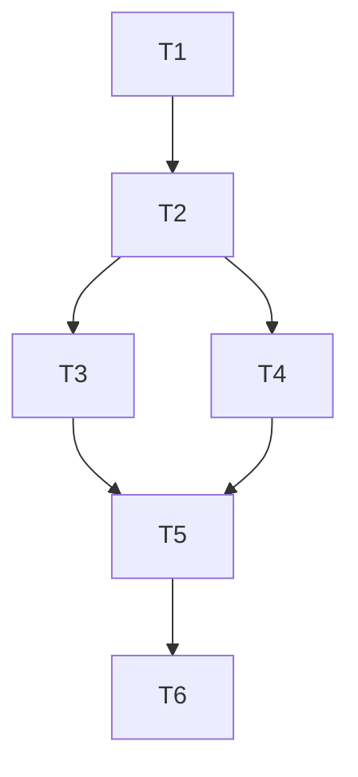

# Telegram Topic Session Isolation: Per-Session Thread Routing

## Objective

Implement Telegram topic/thread-based session isolation so each Codex/Claude session can be routed within a dedicated Telegram thread:

1. Route inbound Telegram replies by `message_thread_id` before heuristic reply-context matching.
2. Bind sessions to Telegram thread IDs and keep outbound session updates in their bound threads.
3. Preserve existing behavior as fallback when topics are unavailable or thread binding is missing.

## Scope

- In:
  - `agent_chat_control_plane.py` Telegram send/fetch/routing behavior
  - session registry schema for Telegram thread bindings and thread-scoped pending create-choice context
  - tests in `tests/test_agent_chat_control_plane.py`
  - docs updates in `README.md`, `docs/control-plane.md`, `docs/troubleshooting.md`
- Out:
  - iMessage behavior changes
  - non-Telegram transport redesign
  - destructive migration of existing registry/session records
  - rich Telegram UI workflows (inline keyboards, slash-menu UX)

## Acceptance Criteria

- Inbound parsing:
  - Telegram update parsing captures `message_thread_id` when present.
  - thread ID is forwarded into inbound routing context.
- Thread-first routing:
  - if a Telegram thread is already bound to a session, implicit inbound replies in that thread resolve to the bound session.
  - strict tmux behavior remains unchanged for ambiguity and non-no-pane failure classes.
- Missing-session flow in threads:
  - unresolved inbound in a Telegram thread triggers runtime-choice prompt (`1/2`, `codex/claude`, `cancel`) scoped to that thread context.
  - selected runtime creates/binds a session to that thread.
- Outbound thread routing:
  - outbound messages for a bound session include `message_thread_id` and appear in the session thread.
  - when thread metadata is absent/unavailable, sender falls back to existing chat-level behavior.
- Regression tests:
  - targeted and existing control-plane tests pass.

## Dependency Graph

## Tasks

### T1: Add tests that define thread-routing behavior
`depends_on: []`

- Add/adjust tests for:
  - Telegram update parsing captures `message_thread_id`
  - thread-bound inbound implicit reply resolves to bound session
  - unresolved thread inbound triggers runtime-choice prompt (not direct create)
  - runtime-choice selection in thread binds created session to that thread
  - outbound send includes `message_thread_id` when session is bound
  - fallback behavior when thread ID is missing or unsupported

### T2: Extend registry schema for Telegram thread mapping and thread-scoped pending choices
`depends_on: [T1]`

- Add registry keys:
  - `telegram_thread_bindings` (thread-key -> session_id)
  - `pending_new_session_choice_by_thread` (thread-key -> pending payload)
- Update:
  - `_default_registry`
  - `_load_registry`
  - `_save_registry`
- Add helper functions:
  - thread-key normalization (`chat_id + thread_id`)
  - get/set/clear binding helpers
  - get/set/clear pending-choice helpers per thread key

### T3: Extend Telegram API helpers for thread-aware send/fetch
`depends_on: [T2]`

- Update `_fetch_telegram_updates` return payload to include `message_thread_id`.
- Update `_send_telegram_message` to accept optional `message_thread_id` and include it in `sendMessage`.
- Keep backward compatibility for callers not providing thread IDs.

### T4: Implement inbound thread-first resolution and thread-scoped choice flow
`depends_on: [T2]`

- In `_process_inbound_telegram_replies`, pass thread metadata into the inbound routing flow.
- In `_process_inbound_replies`:
  - resolve target session from bound thread first (before generic implicit resolution)
  - on unresolved target, persist pending choice under the thread key and prompt in-thread
  - on runtime selection (`codex`/`claude`), create session, bind thread -> session, and clear pending
  - on `cancel`, clear only the matching thread-scoped pending request

### T5: Implement outbound routing to bound thread for session-scoped messages
`depends_on: [T3, T4]`

- When sending Telegram messages tied to a session, look up bound `message_thread_id` and send to that thread.
- Ensure status/accepted/responded/error messages for that session stay in-thread when binding exists.
- Preserve current chat-level send path for unbound sessions or missing thread metadata.

### T6: Update docs and run verification
`depends_on: [T5]`

- Update:
  - `README.md`
  - `docs/control-plane.md`
  - `docs/troubleshooting.md`
- Run validation:
  - targeted thread-routing tests
  - full unit suite

## Decision Log

- 2026-03-01: Thread-first resolution should take precedence over implicit reply-context heuristics for Telegram updates that include `message_thread_id`.
- 2026-03-01: Pending new-session runtime choices should be scoped per Telegram thread key to avoid cross-thread collisions.
- 2026-03-01: Outbound thread routing should be best-effort with fallback to current chat-level send behavior.

## Validation Notes

- Target commands:
  - `/Users/jwei/Documents/agent-chat/.venv/bin/python -m unittest tests.test_agent_chat_control_plane -v`
  - `/Users/jwei/Documents/agent-chat/.venv/bin/python -m unittest discover -s tests -p 'test_*.py' -v`
- Expected result:
  - all tests pass with new thread-routing coverage included.
